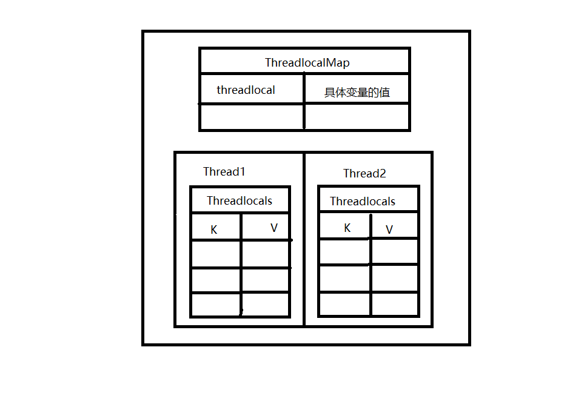
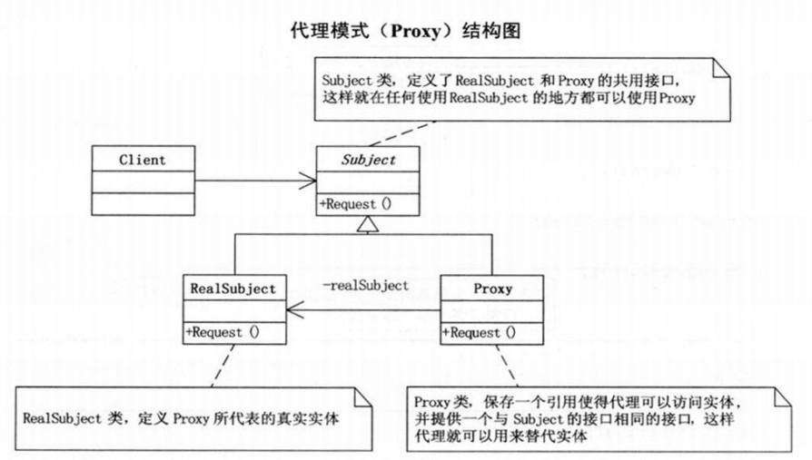
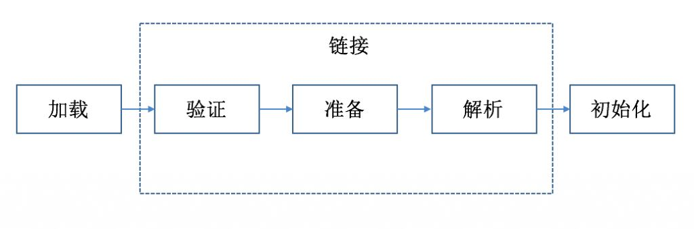

# 2020届秋招面试题总结——JAVA基础篇

**1、JAVA中的几种数据类型是什么，各自占用多少字节。**

Java语言提供了八种基本数据类型。六种数据类型（四个整数型，两个浮点型），一种字符类型，还有一种布尔型。

- byte：1字节，表示范围是-128~127之间。
- short：2字节，表示范围是-32768~32767之间。
- int：4字节，表示范围是负的2的31次方到正的2的31次方减1。
- long：8字节，表示范围为负的2的63次方到正的2的63次方减1。
- float：4字节，表示范围在3.4e-45~1.4e38，直接赋值时必须在数字后加上f或F。
- double：8字节，表示范围在4.9e-324~1.8e308，赋值时可以加d或D也可以不加。

- boolean：只有true和false两个取值。
- char：2字节，存储Unicode码，用单引号赋值。 

**重载和重写的区别
(1) 参数列表：重写不能修改，重载必须修改
(2) 返回值类型：重写不能修改，重载可以修改
(3) 异常：重写可以减少或删除，但不能扩展，重载可以修改

** ==和equals的区别

（1）对于==，比较的是值是否相等；

	如果作用于基本数据类型的变量，则直接比较其存储的“值”是否相等；

	如果作用于引用类型的变量，则比较的是所指向的对象的地址。

（2）对于equals方法，注意：equals方法不能作用于基本数据类型的变量，equals继承Object类，比较的是是否是同一个对象；

	如果没有对equals方法进行重写，则比较的是引用类型的变量所指向的对象的地址；

	诸如String、Date等类对equals方法进行了重写的话，比较的是所指向的对象的内容。

**HashMap、ConcurrentHashMap和HashTable的区别

1. hashmap
底层实现：数组+链表+红黑树（当链表上的node个数超过8的时候，链表变为红黑树）

访问速度很快，但是数据是无序的

HashMap，jdk1.7，数组+链表，链表节点使用Entry类；jdk1.8，数组+链表+红黑树，链表节点使用Node类；Entry是Map的内部接口，1.8的Node是HashMap的静态内部类，实现了Entry接口，1.7的Entry是HashMap的静态内部类，实现的也是Entry接口

非线程安全

默认size=16；负载因子（load factor）=0.75

实际存储的数据达到负载因子的时候，就会扩容，变为原来的两倍

LinkedHashMap：LinkedHashMap是HashMap的一个子类，保存了记录的插入顺序，在用Iterator遍历LinkedHashMap时，先得到的记录肯定是先插入的，也可以在构造时带参数，按照访问次序排序

最多有一个键值null;可以有多个key值为null

2. hashtable

Hashtable通过synchronized修饰方法，是线程安全的，效率低

Hashtable不可以存储null键和null值

3. ConcurrentHashMap
<jdk1.7>
数据结构：
	数组（Segment）+ 数组（HashEntry）+ 链表（HashEntry节点）
	底层一个Segments数组，存储一个Segments对象，一个Segments中储存一个Entry数组，存储的每个Entry对象又是一个链表头结点。
同步方法：
	ConcurrentHashMap通过segment（继承了ReentrantLock）调用父类的锁对象加锁来实现，（分段锁）对整个桶数组进行了分割分段(Segment)，每一把锁只锁容器其中一部分数据，多线程访问容器里不同数据段的数据，就不会存在锁竞争，提高并发访问率。
<jdk1.8>
数据结构：
	Node数组+链表 / 红黑树： 类似hashMap<jdk1.8>
	Node数组使用来存放树或者链表的头结点，当一个链表中的数量到达一个数目时，会使查询速率降低，所以到达一定阈值时，会将一个链表转换为一个红黑二叉树，提高查询的速率。
同步方法：
	通过synchronized同步代码块和 CAS操作来实现线程安全

**2、String类能被继承吗，为什么。**

不能被继承，因为String类有final修饰符，而final修饰的类是不能被继承的。

```java
public final class String implements java.io.Serializable, Comparable<String>, CharSequence {
    // 省略...　
}
```

**3、String，StringBuffer，StringBuilder的区别。**

String为字符串常量（因为内部数组value[]有final修饰），而StringBuilder和StringBuffer均为字符串变量，即String对象一旦创建之后该对象是不可更改的，但后两者的对象是变量，是可以更改的。

在线程安全上，StringBuilder是线程不安全的，而StringBuffer是线程安全的，因为StringBuffer在append()方法上添加了synchronized修饰。

String，StringBuffer，StringBuilder都被final修饰，不能继承。
String变量创建后是放入方法区的常量池（或者常量池）中，而StringBuilder和StringBuffer则是存入堆中。

构造String对象的方式有很多，String的内存分配比较特殊：

- 方式一：String str1="123";

通过引号直接创建字符串对象，先会从常量池中判断是否存在"123"对象，如果不存在，则会在常量池中创建该对象，并且返回常量池中"123"对象的引用给str；如果之前常量池存在"123"的话，则直接返回常量池中"123"的对象引用。

- 方式二：String str2=new String("123");

首先"123"是一个常量字符串，因此会先在常量池创建"123"字符串对象，然后在堆中再创建一个字符串对象，将"123"的字符数组复制到堆中新创建的对象字符数组中，因此该方式不仅会在堆中，还会在常量池中创建"123"字符串对象。

- 方式三：String str3="123".intern();

该种方式通过intern方法返回一个字符串引用，intern方法是一个native方法，当常量池中存在"123"字符串常量时，则直接返回该常量池中的字符串引用；若不存在，则会先在常量池中创建"123"字符串对象，然后返回新创建对象的引用，与方式一类似。该方法常用于将某些经常访问的字符串对象保存在常量池中，避免经常创建对象。
方式四：String str4=str2.intern();

该种方式是在方式二基础上进行的，intern 方法会先判断常量池中是否存在与str2 相同字符串的对象，若有，则返回该引用；若无，则在常量池创建一个引用（CONSTAT_String_info）指向 str2，然后返回该引用，实际上返回的是 str2 的引用。

具体可以参考这篇文献：[String 对象内存分配(常量池和堆的分配)](https://blog.csdn.net/Mypromise_TFS/article/details/81504137)

**4、ArrayList和LinkedList有什么区别。**

- ArraryList是基于动态数组的数据结构，LinkeList是基于链表的数据结构（LinkedList是双向链表，有next也有previous）。
- 对于随机访问get和set，ArrayList优于LinkedList，因为LinkedList要移动指针。
- 对于新增和删除操作add和remove，LinkedList比较占优势，因为ArrayList要移动数据。

**5、讲讲类的实例化顺序，比如父类静态数据，构造函数，字段，子类静态数据，构造函数，字段。当new的时候，他们的执行顺序。**

Java程序的初始化一般遵循3个原则（优先级以此递减）：

- 静态对象（变量）优先于非静态对象（变量）初始化，其中，静态对象（变量）只初始化一次，而非静态对象（变量）可能会初始化多次。
- 父类优先于子类进行初始化。
- 按照成员变量的顺序进行初始化。

当new时，他们的执行顺序为：父类静态变量、父类静态代码块、子类静态变量、子类静态代码块、父类非静态变量、父类非静态代码块、父类构造函数、子类非静态变量、子类非静态代码块、子类构造函数。

**6、用过哪些Map类，都有什么区别，HashMap时线程安全的吗，并发下使用的Map是什么，他们的内部原理分别是什么，比如存储方法，hashcode，扩容，默认容量等。**

主要用过HashMap，HashMap不是线程安全的，并发下使用的Map是ConcurrentHashMap，HashMap是数组+链表+红黑树（JDK1.8增加了红黑树部分）实现的。

HashMap中Node[] table的默认长度length是16，所能容纳的最大容量数据的Node（键值对）个数为threshold=length*Loadfactor。也就是说，在数组定义好长度之后，负载因子越大，所能容纳的键值对个数越多。

哈希表装填因子定义为：α= 填入表中的元素个数 / 哈希表的长度 

结合负载因子的定义公式可知，threshold就是在此Load factor和length(数组长度)对应下允许的最大元素数目，超过这个数目就重新resize(扩容)，扩容后的HashMap容量是之前容量的两倍。默认的负载因子0.75是对空间和时间效率的一个平衡选择。

Hash算法本质上就是三步：取key的hashCode值，高位运算，取模运算。

注意，一般hashtable桶数都会选择素数，因为素数因子最少，能减少冲突。但是，hashmap却采用非常规方法，没有选用素数，而是选用合数，主要是为了在取模和扩容时做优化，同时为了减少冲突，HashMap定位哈希桶索引位置时，也加入了高位参与运算的过程。

强力推荐这篇文章： [Java 8系列之重新认识HashMap]( https://zhuanlan.zhihu.com/p/21673805)

**7、Java8的ConcurrentHashMap为什么放弃了分段锁，有什么问题吗，如果你来设计，你如何设计。**

jdk8放弃了分段锁而采用了Node锁，降低了锁的粒度，提高了性能，并使用CAS操作来确保Node的一些操作的原子性，取代了锁。

但是，ConcurrentHashMap的一些操作使用了synchronized锁，而不是ReentrantLock，虽然说jdk8中对synchronized进行了性能优化，但是我觉得使用ReentrantLock锁能更多的提高性能。

ReenTrantLock的实现是一种自旋锁，通过循环调用CAS操作来实现加锁。它的性能比较好也是因为避免了使线程进入内核态的阻塞状态。

Synchronized是悲观锁，在jdk1.8之后，加入了偏向锁，轻量级锁（自旋锁），性能得到了极大优化。

上述两种锁都是可重入锁，在锁的细粒度和灵活度方面，很明显ReenTrantLock优于Synchronized。

**8、有没有有顺序的Map实现类，如果有，他们怎么保证有序。**

顺序的Map实现类：LinkedHashMap，TreeMap

- LinkedHashMap是基于元素进入集合的顺序或者被访问的先后顺序排序。
- TreeMap则是基于元素的固有顺序（由Comparator或者Comarable确定）。

**9、抽象类和接口的区别，类可以继承多个类么，接口可以继承多个接口吗，类可以实现多个接口吗。**

抽象类和接口的区别有：

- 抽象类可以有自己的实现方法，接口在jdk1.8之后才可以有自己的实现方法（用default修饰）。
- 抽象类的抽象方法必须有继承的子类实现，如果子类不实现，则子类也需要定义为抽象的；接口的抽象方法必须由实现类来实现，如果实现类不能实现接口中所有方法，则将实现类定位为抽象类。
- 抽象方法必须是pulic/protected，接口中的变量隐式指定为public static final变量，抽象方法被隐式指定为public abstract。
- 抽象类中可以存在普通属性、方法、静态属性和方法。如果一个类中有一个抽象方法，那么当前类肯定是抽象类。
- 子类只能继承一个父类，接口可以继承多个接口，类似于：Interface1 Extends Interface2, Interface3, Interface4……
- 类也可以实现多个接口。

主要注意的是，抽象方法不能用synchronized修饰。

从设计角度来看抽象类和接口：

- 抽象类是is a，是实例必须要有的，比如Door必须有开和关。而接口就是has a，可以有也可以没有，比如Door可以有报警器，但不是必须的，是可拓展的行为。
- 抽象类强调的是同类事务的抽象，接口强调的是同类方法的抽象。
- 抽象类是从子类中发现了公共的东西，泛化出父类，然后子类继承父类；接口是根本不知道子类的存在，方法如何实现还不确认，预先定义。
- 若行为跨越不同类的对象，可使用接口；对于一些相似的类对象，用继承抽象类。

**10、继承和聚合的区别在哪。**

分别介绍这几种关系：

- 继承：指的是一个类继承另一个类的功能，并可以增加自己的的新功能的能力，Is-A继承关系是类与类或者接口与接口之间最常见的关系。在Java类中通过关键词extends明确标识。

  

- 实现：指的是一个class类实现interface接口（可以多个）的功能，实现是类与接口之间最常见的关系。在Java类中通过关键词implements明确标识。

  

- 依赖：可以简单的理解，就是一个类A使用到了另一个类B，而这种使用关系是具有偶然性的、、临时性的、非常弱的，但是B类的变化会影响到A；比如某人要过河，需要借用一条船，此时人与船之间的关系就是依赖；表现在代码层面，为类B作为参数被类A在某个method方法中使用。

  

- 关联：关联关系在java中一般使用成员变量来实现，有时也用方法形参的形式实现。依然使用Driver和Car的例子，使用方法参数形式可以表示依赖关系，也可以表示关联关系，毕竟我们无法在程序中太准确的表达语义。

  

- 聚合：是关联关系的一种特例，他体现的是整体与部分、拥有的关系，即has-a的关系，此时整体与部分之间是可分离的，他们可以具有各自的生命周期，部分可以属于多个整体对象，也可以为多个整体对象共享；比如计算机与CPU、公司与员工的关系等。

  

- 组合(a拥有b，a没了b也就没了，实心)：也是关联关系的一种特例，他体现的是一种contains-a的关系，这种关系比聚合更强，也称为强聚合；他同样体现整体与部分间的关系，但此时整体与部分是不可分的，整体的生命周期结束也就意味着部分的生命周期结束；比如你和你的大脑；表现在代码层面，和关联关系是一致的，只能从语义级别来区分；

  

  具体代码层次理解可以看这篇文章： [java--依赖、关联、聚合和组合之间区别的理解]( https://www.cnblogs.com/wanghuaijun/p/5421419.html)

**11、讲讲你理解的nio，他和bio的区别是什么，谈谈reactor模型。**

- BIO：同步阻塞式IO，服务器实现模式为一个连接一个线程，即客户端有连接请求时服务器就需要启动一个线程进行处理，如果这个线程不做任何事情会造成不必要的线程开销，当然可以通过线程池来改善。

- NIO：同步非阻塞式IO，服务器实现模式为一个请求一个线程，即客户端发送的连接请求都会注册到多路复用器上，多路复用器轮询到连接有I/O请求时才启动一个线程进行处理。是基于事件驱动思想完成的。

- AIO：异步非阻塞式IO，服务器实现模式为一个有效请求一个线程，客户端的I/O请求都是由OS先完成了再通知服务器应用去启动线程进行处理。reactor模型：反应器模式（事件驱动模式）：当一个主体发生改变时，所有的属性都得到通知，类似于观察者模式。

- nio和aio区别

NIO：会等数据准备好后，再交由应用进行处理，数据的读取/写入过程依然在应用线程中完成，只是将等待的时间剥离到单独的线程中去，节省了数据准备时间，因为多路复用机制，Selector会得到复用，对于那些读写过程时间长的，NIO就不太适合。

AIO：读完（内核内存拷贝到用户内存）了系统再通知应用，使用回调函数，进行业务处理，AIO能够胜任那些重量级，读写过程长的任务。

解释一下同步与异步：

- 同步IO，是一种用户空间与内核空间的调用发起方式。同步IO是指用户空间线程是主动发起IO请求的一方，内核空间是被动接受方。

- 异步IO则反过来，是指内核kernel是主动发起IO请求的一方，用户线程是被动接受方。

再解释一下阻塞和非阻塞：

- 阻塞是指用户空间（调用线程）一直在等待，而且别的事情什么都不做；

- 非阻塞是指用户空间（调用线程）拿到状态就返回，IO操作可以干就干，不可以干，就去干的事情。

I/O多路复用是指内核一旦发现进程中指定的一个或者多个IO条件准备读取，它就通知该进程。也可以理解为，使用一个线程来检查多个文件描述符(Socket)的就绪状态，比如调用select和poll函数，传入多个文件描述符，如果有一个文件描述符就绪，则返回，否则阻塞直到超时。得到就绪状态后进行真正的操作可以在同一个线程里执行，也可以启动线程执行(比如使用线程池)。

具体reactor可以看这篇文章： [Reactor模式详解]( https://www.cnblogs.com/winner-0715/p/8733787.html)

在Java中，Selector这个类是select/epoll/poll的外包类。

**12、反射的原理，反射创建类实例的三种方式是什么。**

反射机制：Java反射机制是在运行状态中，对于任意一个类，如果知道一个类的名称，都能够知道这个类的所有属性和方法；对于任意一个对象，如果知道一个实例对象，都能够调用它的任意一个方法和属性；这种动态获取的信息以及动态调用对象的方法的功能称为Java语言的反射机制。

反射获取Class对象有三种方式：
* 使用Class.forName("类路径名称")静态方法。
* 使用类的.class方法。
* 使用实例对象的getClass()方法。

根据Class获取实例对象有两种方式：

- 直接使用字节码文件获取对应实例，Object o=clazz.newInstance();
- 对带参数的构造函数的类，先获取到其构造对象，再通过该构造方法类获取实例，如下。

```java
/ /获取构造函数类的对象
Constroctor constroctor = clazz.getConstructor(String.class,Integer.class); 
// 使用构造器对象的newInstance方法初始化对象
Object obj = constroctor.newInstance("龙哥", 29); 
```

**13、反射中，Class.forName 和ClassLoader区别。**

ClassLoader是类加载器，通过一个类的全限定名来获取描述此类的二进制字节流，遵循双亲委派模型，将.class文件加载到jvm中，不会执行static中的内容（会先赋值为零值），只有在newInstance才会执行static块。

class.forName()方法内部实际上也是调用的ClassLoader来实现，但会对类进行初始化，执行类中的静态代码块，以及对静态变量的赋值等操作。

**14、描述动态代理的几种实现方式，分别说出相应的优缺点。**

动态代理有两种实现方式，分别是：jdk动态代理和cglib动态代理。

- jdk动态代理的前提是目标类必须实现一个接口，代理对象跟目标类实现一个接口。

- cglib动态类是继承并重写了目标类（enhancer.create()方法返回的就是一个继承目标类的子类），所以目标类和方法不能被声明为final。

具体可以看我的另一篇文章，详细讲解了，[记动态代理](../notes/记动态代理.md)

CGLib创建的动态代理对象性能比JDK创建的动态代理对象的性能高不少，但是CGLib在创建代理对象时所花费的时间却比JDK多得多，所以对于单例的对象，因为无需频繁创建对象，用CGLib合适，反之，使用JDK方式要更为合适一些。

**15、动态代理与cglib实现的区别。**

- JDK动态代理是通过接口中的方法名，在动态生成的代理类中调用业务实现类的同名方法；

- CGlib动态代理是通过继承业务类，生成的动态代理类是业务类的子类，通过重写业务方法进行代理；

**16、为什么CGlib方式可以对接口实现代理。**

cglib动态代理是继承并重写目标类，所以目标类和方法不能被声明为final。而接口时可以被继承的。

**17、final的用途。**

 * final修饰的对象不能被修改。
 * final修饰的类不能被继承。
 * final修饰的方法不能被重写（但可以被重载）。

**19、如何在父类中为子类自动完成所有的hashcode和equals实现，这样做有何优劣。**

父类的equals不一定满足子类的equals需求。比如所有的对象都继承于Object，默认使用的是Object的equals方法，在比较两个对象的时候，是看他们是否指向同一个地址。

但我们的需求时对象的某个属性想通了，就相等了，而默认的equals方法满足不了当前的需求，所以要重写equals方法，加入自定义逻辑。

重写equals方法就必须重写hashcode方法，否则就会降低map等集合的索引速度。

**20、请结合OO设计理念，谈谈访问修饰符public、private、protected、default在应用设计中的作用。**

OO面向对象编程的设计理念是：

- 抽象，先不考虑细节

- 封装，隐藏内部实现

- 继承，复用现有代码

- 多态，改写对象行为

封装，也就是把客观事物封装成抽象的类，并且类可以把自己的变量和方法只让可信的类或者对象操作，对不可信的进行隐藏，所以我们可以通过修饰符public、private、protected、default来进行访问控制。

| 修饰符    | 类内部 | 本包 | 子类 | 外部包 |
| --------- | ------ | ---- | ---- | ------ |
| public    | √      | √    | √    | √      |
| protected | √      | √    | √    | ×      |
| default   | √      | √    | ×    | ×      |
| private   | √      | ×    | ×    | ×      |

**21、深拷贝和浅拷贝的区别。**

- 浅拷贝：对基本数据类型进行值传递，对引用数据类型进行引用传递般的拷贝。

- 深拷贝：对基本数据类型进行值传递，对引用数据类型，创建一个新的对象，并复制其内容。

**22、数组和链表数据结构描述，各自的时间复杂度。**

- 数组是将元素在内存中连续存放，由于每个元素占用内存空间相同，可以通过下标迅速访问数组中任何元素。
- 链表恰好相反，链表中元素在内存中不是顺序存储的，而是通过存在元素中的指针联系到一起。
- 数组利用下标定位，时间复杂度为O(1)，链表定位元素时间复杂度O(n)；
- 数组插入或删除元素的时间复杂度O(n)，链表的时间复杂度O(1)。
- 数组和栈都存放在堆中，在虚拟机栈中只需要定义引用变量即可。

**23、error和exception的区别，CheckedException，RuntimeException的区别。**

- Exception和Error都是继承于Throwable 类，在 Java 中只有 Throwable 类型的实例才可以被抛出（throw）或者捕获（catch），它是异常处理机制的基本组成类型。

- error（错误）表示系统级的错误和程序不必处理的异常，是java运行环境中的内部错误或者硬件问题。比如：内存资源不足等。对于这种错误，程序基本无能为力，除了推出运行外别无选择，它是由java虚拟机抛出的，是不可预料的异常情况。

- Exception（违例）表示需要捕捉或者需要程序进行处理的异常，他处理的是因为程序设计的瑕疵而引起的问题或者在外的输入等引起的一般性问题，是程序必须处理的，是可预料的异常情况。


Exception又分为运行时异常，受检查异常。


- CheckedException（检查性异常）必须在编写代码时，使用try catch捕获（比如：IOException异常）。

- RuntimeException（运行时异常）在代码编写时可以忽略捕获操作（比如：ArrayIndexOutOfBoundsException），这种异常是在代码编写或者使用过程中通过规范可以避免发生的。

**24、请列出5个运行时异常。**

- NullPointerException(空指针)
- IndexOutOfBoundsException(数组越界)
- ClassCastException(类转换异常)
- ArrayStoreException(数据存储异常，操作数组时类型不一致)
- IllegalArgumentException（非法参数异常）

**26、说一说你对java.lang.Object对象中的hashCode和equals方法的理解。在什么场景下需要重新实现这两个方法。**

Object类中的equals方法和“==”是一样的，没有区别，即俩个对象的比较是比较他们的栈内存中存储的内存地址。而String类，Integer类等等一些类，是重写了equals方法，才使得equals和“==不同”，他们比较的是值是不是相等。所以，当自己创建类时，自动继承了Object的equals方法，要想实现不同的等于比较，必须重写equals方法。比如我们的需求是对象的某个属性相同，就相等了，而默认的equals方法满足不了当前的需求，所以我们要重写equals方法。

如果重写了equals方法就必须重写hashcode方法，否则就会降低map等集合的索引速度。

**27、在jdk1.5中，引入了泛型，泛型的存在是用来解决什么问题。**

泛型的好处是在编译的时候检查类型安全，减少运行时由于对象类型不匹配引发的异常，并且所有的强制转换都是自动和隐士的，提高代码的复用率。

**28、这样的a.hashcode()有什么用，与a.equels(b)有什么关系。**

hashCode()方法是得到相应对象的hash值，它常用于基于hash的集合类，比如Hashtable，HashMap，LinkedHashMap等等。它与equals()方法关系特别密切，根据java规范，两个通过equals()方法来判断为相等的对象，必须拥有相同的hashcode。

**29、有没有可能2个不相等的对象有相同的hashcode。**

有可能，最简单的方法是在自己实现类中重写hashcode()方法。

**30、Java中的HashSet内部是如何工作的？**

HashSet内部默认是通过一个HashMap来实现的。如下

```Java
public HashSet() {
    map = new HashMap<>();
}
private static final Object PRESENT = new Object();
public boolean add(E e) {
    return map.put(e, PRESENT)==null;//其中PRESENT是一个虚拟的对象。
}
```

**31、什么是序列化，怎么序列化，为什么序列化，反序列化会遇到什么问题，如何解决。**

序列化是一种用户处理对象流的机制，所谓对象流就是将对象的内容进行流化。

- 序列化：把对象转换为字节序列的过程称为对象的序列化。
- 反序列化：把字节序列恢复为对象的过程称为对象的反序列化。

对象实现序列化只需要实现Serializable接口即可。

意义：序列化机制允许将实现序列化的Java对象转换位字节序列，这些字节序列可以保存在磁盘上，或通过网络传输，以达到以后恢复成原来的对象。序列化机制使得对象可以脱离程序的运行而独立存在。

使用场景：所有可在网络上传输的对象都必须是可序列化的，比如RMI（remote method invoke,即远程方法调用），传入的参数或返回的对象都是可序列化的，否则会出错；所有需要保存到磁盘的java对象都必须是可序列化的。通常建议：程序创建的每个JavaBean类都实现Serializeable接口

- Java序列化算法
所有保存到磁盘的对象都有一个序列化编码号
当程序试图序列化一个对象时，会先检查此对象是否已经序列化过，只有此对象从未（在此虚拟机）被序列化过，才会将此对象序列化为字节序列输出。如果此对象已经序列化过，则直接输出编号即可。

- 弊端
由于java序利化算法不会重复序列化同一个对象，只会记录已序列化对象的编号。如果序列化一个可变对象（对象内的内容可更改）后，更改了对象内容，再次序列化，并不会再次将此对象转换为字节序列，而只是保存序列化编号。

**32、java8的新特性。**

- Lambda表达式和函数式接口
- 接口的默认方法和静态方法，允许在接口内添加新的方法。
- 重复注解，允许在同一个地方多次使用同一个注解。

**33、Java序列化和反序列化相关。**

Java序列化的的是对象的非静态字段及其值。

Transient关键字修饰的成员变量在序列化过程中会被自动忽略。

而static静态成员属于类变量，也无法被序列化。

**34、二叉树、平衡二叉树、红黑树的性质。**

普通的二叉查找树的性质是：
 * 若它的左子树不空，则左子树上所有结点的值均小于它的根节点的值；
 * 若它的右子树上所有结点的值均大于它的根节点的值；
 * 它的左、右子树也分别为二叉排序树。

平衡二叉树，又被称为AVL树，它的左右两个子树的高度差不能超过1。平衡二叉树的目的是为了减少二叉查找树层次，提高查找速度。

**红黑树
- 性质1：每个节点要么是黑色，要么是红色。
- 性质2：根节点是黑色。
- 性质3：每个叶子节点（NIL）是黑色。
- 性质4：每个红色结点的两个子结点一定都是黑色。
- 性质5：任意一结点到每个叶子结点的路径都包含数量相同的黑结点。
红黑树是一种弱平衡二叉树，通过对任何一条从根到叶子的路径上各个节点着色的方式的限制，红黑树确保没有一条路径会比其它路径长出两倍

红黑树的时间复杂度为O(logN)，效率很高。

有一个比较有意思的小公式，树中节点数=总分叉数+1。（这里的分叉数就是所有节点的度之和）

后续的B-树或者B+树都是多路搜索树，不一定是二叉的了。在MySQL那篇我会仔细说明。

**36、Java中对象的引用。**

Java语言中，除了原始的八个基本数据类型外，其他都是引用类型，指向各种不同的对象。不同的引用类型，不同之处在于对象不同的可达性及对垃圾回收的影响。主要分为：

- 强引用：

只要引用存在，垃圾回收器永远不会回收。例如：

```java
Object obj = new Object(); //其中obj就是强引用。通过关键字new创建的对象所关联的引用是强引用。
```

特点：JVM内存空间不足时，JVM宁愿抛出OutOfMemoryError（OOM）运行时错误，使程序异常终止，也不会靠随意回收具有强引用的“存活”对象来解决内存不足的问题。对于一个普通对象，如果没有其他的引用关系，只要超过了引用的作用域（如超出局部变量作用范围）或者显示将相应（强）引用赋值为null，就可以根据具体的垃圾回收机制被回收。

- 软引用：

软引用通过SoftReference实现，非必须引用，生命周期比强引用短一些，内存溢出之前进行回收。

应用场景： 软引用通常用来实现内存敏感的缓存。如果还有空闲内存，就可以暂时保留缓存，当内存不足时清理掉，这样就保证了使用缓存的同时，不会耗尽内存。

- 弱引用：

弱引用通过WeakReference类实现，弱引用的生命周期比软引用短，被弱引用关联的对象只能生存到下一次垃圾回收之前，。在垃圾回收器线程扫描它所管辖的内存区域的过程中，一旦发现具有弱引用的对象，不管当前的内存空间足够与否，都会回收他的内存。（由于垃圾回收器线程是一个优先级很低的线程，因此不一定会很快回收弱引用的对象）。

应用场景：弱引用同样是很多缓存实现的选择。

- 幻象引用（虚引用）：

通过PhantomReference类来实现。无法通过幻象引用访问对象的任何属性或函数。幻象引用仅仅是提供一种确保对象被finalize以后，做某些事情的机制。如果一个对象仅持有幻象引用，那么他就和没有任何引用一样，在任何时候都可能被垃圾回收器回收。

当虚引用的对象被回收的时候，会向队列Queue中push一个消息，使得我们可以知道该引用可以被回收。

应用场景：管理堆外内存。对于jvm之外引用的内存，jvm内存回收机制是无法知道该引用是否可以被回收。因此，通过虚引用，在Queue中可以得知该堆外内存可以被回收。

- threadlocal

（1）threadlocal是什么？

从名字我们就可以看到ThreadLocal叫做线程变量，意思是ThreadLocal中填充的变量属于当前线程，该变量对其他线程而言是隔离的。ThreadLocal为变量在每个线程中都创建了一个副本，那么每个线程可以访问自己内部的副本变量。

(2)threadlocal的使用场景

    1、在进行对象跨层传递的时候，使用ThreadLocal可以避免多次传递，打破层次间的约束。

    2、线程间数据隔离

    3、进行事务操作，用于存储线程事务信息。

    4、数据库连接，Session会话管理。

我们使用数据库的时候首先就是建立数据库连接，然后用完了之后关闭就好了，这样做有一个很严重的问题，如果有1个客户端频繁的使用数据库，那么就需要建立多次链接和关闭，我们的服务器可能会吃不消，怎么办呢？如果有一万个客户端，那么服务器压力更大。

这时候最好ThreadLocal，因为ThreadLocal在每个线程中对连接会创建一个副本，且在线程内部任何地方都可以使用，线程之间互不影响，这样一来就不存在线程安全问题，也不会严重影响程序执行性能。

（3）threadlocal源码分析
 
 threadlocal的内部结构
 


```java
public void set(T value) {
        Thread t = Thread.currentThread();
        ThreadLocalMap map = getMap(t);
        if (map != null)
            map.set(this, value);
        else
            createMap(t, value);
    }
```

从set方法我们可以看到，首先获取到了当前线程t，然后调用getMap获取ThreadLocalMap，如果map存在，则将当前线程对象t作为key，要存储的对象作为value存到map里面去。如果该Map不存在，则初始化一个。

```java
static class ThreadLocalMap {
        static class Entry extends WeakReference<ThreadLocal<?>> {
            /** The value associated with this ThreadLocal. */
            Object value;

            Entry(ThreadLocal<?> k, Object v) {
                super(k);
                value = v;
            }
        }
        ......
}
```

我们可以看到ThreadLocalMap其实就是ThreadLocal的一个静态内部类，里面定义了一个Entry来保存数据，而且还是继承的弱引用。在Entry内部使用ThreadLocal作为key，使用我们设置的value作为value

```java
public T get() {
        Thread t = Thread.currentThread();
        ThreadLocalMap map = getMap(t);
        if (map != null) {
            ThreadLocalMap.Entry e = map.getEntry(this);
            if (e != null) {
                @SuppressWarnings("unchecked")
                T result = (T)e.value;
                return result;
            }
        }
        return setInitialValue();
    }
```

首先获取当前线程，然后调用getMap方法获取一个ThreadLocalMap，如果map不为null，那就使用当前线程作为ThreadLocalMap的Entry的键，然后值就作为相应的的值，如果没有那就设置一个初始值。

```java
public void remove() {
         ThreadLocalMap m = getMap(Thread.currentThread());
         if (m != null)
             m.remove(this);
     }
```
remove方法用于移除threadlocalmap中的对象

（4）内存泄漏问题
我们知道在thread里面维护着threadlocalMap，ThreadLocalMap的key是ThreadLocal，值是我们自己设定的。由于threadlocal是一个弱引用，那么当threadlocal被设置成null的时候，GC就会在执行内存回收的时候将threadlocalmap中的可以、回收。由于threadlocalMap的生命周期和它所属的thread是一样的，那么它就不会被回收，就会出现threadlocalMap键为空但是值还存在的情况，就会造成内存泄漏。

解决办法：使用完ThreadLocal后，执行remove操作，避免出现内存泄漏情况。

#### 总结

（1）每个Thread维护着一个ThreadLocalMap的引用

（2）ThreadLocalMap是ThreadLocal的内部类，用Entry来进行存储

（3）ThreadLocal创建的副本是存储在自己的threadLocals中的，也就是自己的ThreadLocalMap。

（4）ThreadLocalMap的键值为ThreadLocal对象，而且可以有多个threadLocal变量，因此保存在map中

（5）在进行get之前，必须先set，否则会报空指针异常，当然也可以初始化一个，但是必须重写initialValue()方法。

（6）ThreadLocal本身并不存储值，它只是作为一个key来让线程从ThreadLocalMap获取value。

（7）threadlocal在父子线程之间是不可以继承的


**37、select、poll和epoll之间的区别。**

链接：https://www.processon.com/view/link/5f36856b5653bb06f2ce529f

目前支持I/O多路复用的系统调用有select、poll和epoll，I/O多路复用就是通过一种机制，一个进程可以监视多个描述符，一旦某个描述符就绪（一般是读就绪或者写就绪），能够通知程序进行相应的读写操作。但select、poll和epoll本质上都是同步I/O，因为它们都需要在读写事件就绪后自己负责进行读写，也就是说这个读写过程是阻塞的，而异步I/O则无需自己负责进行读写，异步I/O的实现会负责把数据从内核拷贝到用户空间。

与多进程和多线程技术相比，I/O多路复用技术的最大优势是系统开销小，系统不必创建进程/线程，也不必维护这些进程/线程，从而大大减小了系统的开销。

(1)select==>时间复杂度O(n)

它仅仅知道了，有I/O事件发生了，却并不知道是哪那几个流（可能有一个，多个，甚至全部），我们只能无差别轮询所有流，找出能读出数据，或者写入数据的流，对他们进行操作。所以select具有O(n)的无差别轮询复杂度，同时处理的流越多，无差别轮询时间就越长。

(2)poll==>时间复杂度O(n)

poll本质上和select没有区别，它将用户传入的数组拷贝到内核空间，然后查询每个fd对应的设备状态， 但是它没有最大连接数的限制，原因是它是基于链表来存储的.

(3)epoll==>时间复杂度O(1)

epoll可以理解为event poll，不同于忙轮询和无差别轮询，epoll会把哪个流发生了怎样的I/O事件通知我们。所以我们说epoll实际上是事件驱动（每个事件关联上fd）的，此时我们对这些流的操作都是有意义的。（复杂度降低到了O(1)）

select，poll，epoll都是IO多路复用的机制。I/O多路复用就通过一种机制，可以监视多个描述符，一旦某个描述符就绪（一般是读就绪或者写就绪），能够通知程序进行相应的读写操作。但select，poll，epoll本质上都是同步I/O，因为他们都需要在读写事件就绪后自己负责进行读写，也就是说这个读写过程是阻塞的，而异步I/O则无需自己负责进行读写，异步I/O的实现会负责把数据从内核拷贝到用户空间。  

- select

select 函数监视的文件描述符分3类，分别是writefds、readfds、和exceptfds。调用后select函数会阻塞，直到有描述符就绪（有数据 可读、可写、或者有except），或者超时（timeout指定等待时间，如果立即返回设为null即可），函数返回。当select函数返回后，可以通过遍历fdset，来找到就绪的描述符。

它的优点是跨平台性能好，几乎在所有的平台上都支持。

select的不足在三个方面，第一个是单个进程能够监视的文件描述符的数量存在最大限制，在Linux上一般为1024。第二个是对socket进行扫描时是线性扫描，即采用轮询的方式，效率较低。第三个是需要维护一个用来存放大量fd的数据结构，这样会使用户空间和内核空间在传递该结构时复制开销大。

- poll

poll和select没有区别，它的优点是没有最大连接数的限制，原因是它是基于链表来存储的，但是同样有一个缺点，则是大量的fd数组被整体复制于用户态和内核地址之间。

- epoll

epoll是select和poll的增强版本，相对于前两者来说，它更加灵活，没有描述符的数量限制。epoll使用一个文件描述符管理多个描述符，将用户关系的文件描述符的事件存放到内核的一个事件表中，这样在用户空间和内核空间的copy只需一次。所有的fd都存入红黑树中。

epoll支持水平触发和边缘触发，最大的特点是边缘触发，它只告诉线程哪些fd刚刚变为就绪态，并且只会通知一次。还有一个特点是，epoll通过“事件”的就绪通知方式，通过epoll_ctl注册fd，一旦该fd就绪，内核就会采用类似callback的回调机制来把该fd放入到双向链表（保存已就绪的事件），epoll_wait便可以收到通知。

epoll的优点主要是三个方面：第一是没有最大并发连接的限制，能打开的FD的上限远大于1024；第二是效率提升，不是轮询的方式，不会随着FD数目的增加效率下降，这时候用到了回调；第三是内存拷贝，使用mmap减少了复制开销。

综上：

 * 表面上看epoll的性能最好，但是在连接数少并且连接都十分活跃的情况下，select和poll的性能可能比epoll好，毕竟epoll的通知机制需要很多函数回调。
 * select低效是因为每次它都需要轮询。但低效也是相对的，视情况而定，也可通过良好的设计改善。

**38、final修饰的变量是引用不可变，还是引用的对象不能改变。**

final修饰的变量是引用不可变，但是引用的对象还是可以发生改变。

如果final修饰的是一个基本数据类型的变量，那么这个变量就确定了，不能变了。

而如果final修饰的是一个引用变量，那么该变量存的是一个内存地址，该地址就不能变了，但是该地址所指向的那个对象还是可以变的。

举个例子

```Java
final StringBuilder sb=new StringBuilder();
//sb=new StringBuilder();//程序报错。
sb.append("a");//成功执行，sb对象内部可以改变。
```

**39、Java中Comparable和Comparator接口的区别。**

Comparable是排序接口，若一个类实现了Comparable接口，就意味着这个类支持排序，不需要再去指定比较器。接口中通过x.compareTo(y)来比较x和y的大小。若返回负数，意味着x比y小；返回零，意味着x等于y；返回正数，意味着x大于y。

Comparator是比较器接口。我们若需对某个类集合进行排序，而该类本身不支持排序（即没有实现Comparable接口），那么，我们就可以建立一个“该类的比较器”来进行排序。这个比较器只需要实现Comparator接口即可。

两者的联系则为：Comparable相当于内部比较器，而Comparator相当于外部比较器。

**40、如何通过反射获取和设置对象私有字段的值。**

可以通过类对象的getDeclaredField()方法字段（Field）对象，然后再通过字段对象的setAccessible(true)将其设置为可以访问，接下来就可以通过get/set方法来获取/设置字段的值了。代码如下所示。

```java
public class Test {
    static class User {
        private String name;
        private int age;
    }
    public static void main(String[] args) {
        Class<User> clz = User.class;
        try {
            Field age = clz.getDeclaredField("age");
            age.setAccessible(true);
            Object obj = clz.newInstance();
            age.setInt(obj, 18);
        } catch (Exception e) {
            e.printStackTrace();
        }
    }
}
```

**41、sleep()方法和yield()方法的区别。**

- sleep()方法给其他线程运行机会时不考虑线程的优先级，因此会给低优先级的线程以运行的机会；yield()方法只会给相同优先级或更高优先级的线程以运行的机会。
- 线程执行sleep()方法后转入阻塞（blocked）状态，而执行yield()方法后转入就绪（ready）状态。
- sleep()方法声明抛出InterruptedExecption，而yield()方法没有声明任何异常。
- sleep()方法比yield()方法（跟操作系统CPU调度相关）具有更好的可移植性。

需要注意的是：

如果线程A希望立即结束线程B，则可以对线程B对应的Thread实例调用interrupt方法。如果此刻线程B正在wait/sleep/join，则线程B会立刻抛出InterruptedException，在catch() {} 中直接return即可安全地结束线程。

**42.Java中Map集合中的Entry对象**
Entry: 键值对 对象。
        在Map类设计是，提供了一个嵌套接口（static修饰的接口）：Entry。Entry将键值对的对应关系封装成了对象，即键值对对象，这样我们在遍历Map集合时，就可以从每一个键值对（Entry）对象中获取对应的键与对应的值。
Entry为什么是静态的？
        Entry是Map接口中提供的一个静态内部嵌套接口，修饰为静态可以通过类名调用。
Map集合遍历键值对的方式：

    Set<Map.Entry<K,V>> entrySet();//返回此映射中包含的映射关系的Set视图 
该方法返回值是Set集合，里面装的是Entry接口类型，即将映射关系装入Set集合。
实现步骤：
1，调用Map集合中的entrySet()方法，将集合中的映射关系对象存储到Set集合中
2，迭代Set集合
3，获取Set集合的元素，是映射关系的对象
4，通过映射关系对象的方法，getKey()和getValue(),获取键值对

### java锁

https://www.cnblogs.com/jyroy/p/11365935.html

### jvm运行时存储区

https://blog.csdn.net/qq906627950/article/details/81324825


### java动态代理
1. 代理模式三要素：
- 公共接口：提供了实际对象和代理对象的公共方法接口。
- 实际类：最终被引用的对象，提供实际的服务。
- 代理类：代理类与实际类存在关联关系，保存实际对象的引用，代理类主要负责为委托类预处理消息、过滤消息、把消息转发给委托类，以及事后处理消息等。
- 如图：


2. 静态代理
- 在编译时就已经确定了接口、被代理类和代理类。
- 代理是固定的，修改比较麻烦。
3. 动态代理
   
（1）基于JDK的动态代理（持有包装对象的方式）

- Proxy类
    - 作为调度器存在，调用具体的代理。
- InvocationHandler接口
    - 作为增强器存在，提供所需服务之外的其他服务。
    - 只含有一个方法。在实际使用时，第一个参数obj一般是指代理类，method是被代理的方法，args为该方法的参数数组。这个抽象方法在代理类中动态实现
    ```java
    public object invoke(Object obj,Method method, Object[] args)
    ```
- 动态代理步骤：
    - 创建一个实现接口InvocationHandler的类，它必须实现invoke方法
    - 创建被代理的类以及接口
    - 通过Proxy的静态方法newProxyInstance(ClassLoaderloader, Class[] interfaces, InvocationHandler h)创建一个代理。
    - 通过代理调用方法
（2）基于CGLIB的动态代理（继承的方式，需要导入jar包）
- 介绍

  JDK的动态代理机制只能代理实现了接口的类，而不能实现接口的类就不能实现JDK的动态代理，cglib是针对类来实现代理的，他的原理是对指定的目标类生成一个子类，并覆盖其中方法实现增强，但因为采用的是继承，所以不能对final修饰的类进行代理。

### java类加载过程
参考博客：https://blog.csdn.net/justloveyou_/article/details/72217806

类加载过程即是指JVM虚拟机把.class文件中类信息加载进内存，并进行解析生成对应的class对象的过程。举个通俗点的例子来说，JVM在执行某段代码时，遇到了class A， 然而此时内存中并没有class A的相关信息，于是JVM就会到相应的class文件中去寻找class A的类信息，并加载进内存中，这就是我们所说的类加载过程。

由此可见，JVM不是一开始就把所有的类都加载进内存中，而是只有第一次遇到某个需要运行的类时才会加载，且只加载一次。

（1）类加载过程

- 加载
  - 由类加载器负责根据一个类的全限定名来读取此类的二进制字节流到JVM内部的运行时数据区（一般是方法区），然后将其转换为一个Java.language.Class对象实例，作为该类的各种数据的访问入口
- 验证
  - 验证数据信息是否符合JVM规范，是否是一个有效的字节码文件，验证内容包括类数据信息的格式、语义分析、验证操作等。
- 准备
  - 为类中的static变量分配空间并初始化（与程序无关，初始化为系统的默认值）
  - 被final修饰的变量初始化为代码中的值
- 解析
  - 将常量池中的所有符号引用替换为直接引用（得到类或者字段、方法在内存中的指针或者偏移量，以便直接调用该方法）。可以认为是一些静态绑定的会被解析，动态绑定则只会在运行时进行解析；静态绑定包括一些final方法(不可以重写),static方法(只会属于当前类)，构造器(不会被重写)；
- 初始化
  - 为类的静态变量赋值，然后执行类的初始化语句
  - 详细过程
    - 如果类还没有被加载和链接，先进行加载和链接
    - 如果类存在父类并且父类还没有初始化，先对父类进行初始化
    - 如果类中存在初始化static语句，顺序执行初始化语句
    - JVM必须确保一个类在初始化的过程中，如果是多线程需要同时初始化它，仅仅只能允许其中一个线程对其执行初始化操作，其余线程必须等待，只有在活动线程执行完对类的初始化操作之后，才会通知正在等待的其他线程。
  - class初始化时机
    - 创建类的实例（new、反射、反序列化、clone）
    - 访问类中的某个静态变量或者对静态变量进行赋值
    - 主动调用类的静态方法
    - Class.forName("包类名") //jabc驱动加载
    - 完成子类的初始化，也会完成对本类的初始化
    - 该类时程序引导入口（main入口、test入口）

（2）类加载器（Class Loader）

- 启动（Bootstrap）类加载器
  - 它用来加载 Java 的核心类，是用原生代码来实现的，并不继承自 java.lang.ClassLoader，返回值为null
  - 负责加载$JAVA_HOME中jre/lib/rt.jar、resource.jar里所有的class，由C++实现，不是ClassLoader子类
  - 由于引导类加载器涉及到虚拟机本地实现细节，开发者无法直接获取到启动类加载器的引用，所以不允许直接通过引用进行操作。
  - 指定加载java、javax、sun等开头的包类名
- 扩展（Extension）类加载器
  - 继承自Bootstrap ClassLoader，返回值为null
  - Java语言编写的类加载器sun.misc.Launcher$ExtClassLoader
  - 负责加载java平台中扩展的一些jar包，包括$JAVA_HOME中jre/lib/ext或者由系统变量-Djava.ext.dir指定位置中的类库加载到内存中。开发者可以直接使用标准扩展类加载器
- 系统（System）类加载器（或者应用类（Application）加载器）
  - 继承自 Extension ClassLoader
  - 系统类加载器是由 Sun 的 AppClassLoader（sun.misc.Launcher$AppClassLoader）实现的，它负责将用户类路径(java -classpath或-Djava.class.path变量所指的目录，即当前类所在路径及其引用的第三方类库的路径)下的类库加载到内存中。开发者可以直接使用系统类加载器
- 用户自定义类加载器
  - 可以通过重写loadClass函数破坏双亲委派机制
  - 好处
    - 防止源码泄漏
    - jar包隔离

(3)双亲委派加载机制


- JVM在加载类时默认采用的是双亲委派机制。通俗的讲，就是某个特定的类加载器在接到加载类的请求时，首先将加载任务委托给父类加载器，依次递归 (本质上就是loadClass函数的递归调用)，因此所有的加载请求最终都应该传送到顶层的启动类加载器中。如果父类加载器可以完成这个类加载请求，就成功返回；只有当父类加载器无法完成此加载请求时，子加载器才会尝试自己去加载。事实上，大多数情况下，越基础的类由越上层的加载器进行加载，因为这些基础类之所以称为“基础”，是因为它们总是作为被用户代码调用的API（当然，也存在基础类回调用户用户代码的情形，即破坏双亲委派模型的情形）。 
- 作用
  - 避免类的重复加载
  - 保护程序的安全，防止核心的Java语言环境遭到破坏